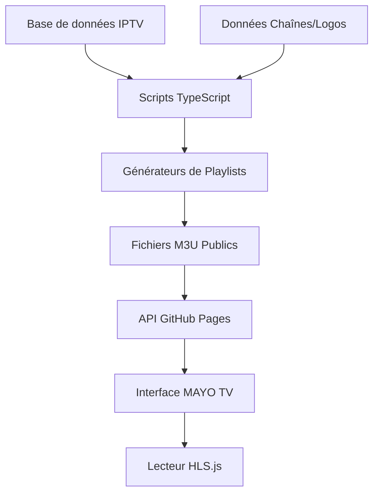
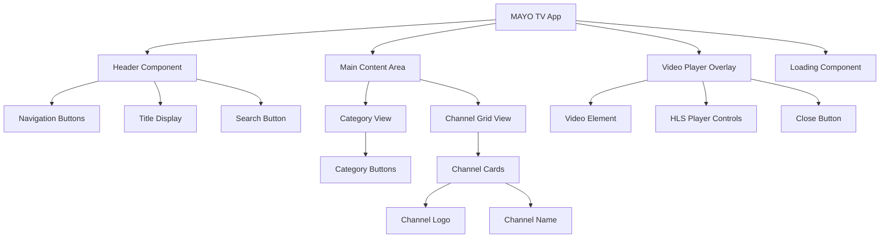
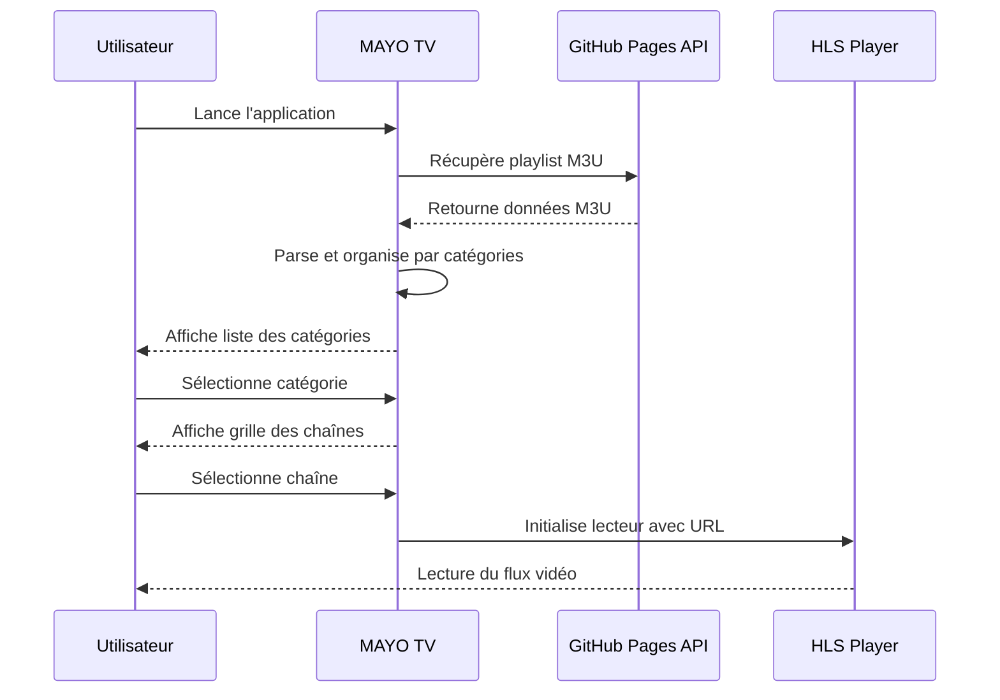

# Design d'Implémentation MAYO TV - Interface Web IPTV

## Vue d'ensemble

Cette conception décrit l'implémentation d'une interface web moderne pour lecteur IPTV appelée "MAYO TV" dans le projet iptv-org existant. L'objectif est d'intégrer la maquette HTML/CSS/JavaScript existante comme composant web officiel du projet, permettant aux utilisateurs de visualiser et de lire les chaînes IPTV directement via une interface web responsive.

### Valeur métier
- Fournir une interface utilisateur moderne et intuitive pour accéder aux chaînes IPTV
- Améliorer l'expérience utilisateur avec un design mobile-first responsive
- Offrir une alternative web aux lecteurs IPTV traditionnels
- Démocratiser l'accès aux flux IPTV sans nécessiter d'installations logicielles

### Public cible
- Utilisateurs finaux souhaitant visionner des chaînes IPTV via navigateur web
- Développeurs intégrant l'API iptv-org dans leurs applications
- Administrateurs de systèmes IPTV cherchant une interface de démonstration

## Architecture Technique

### Stack Technologique
- **Frontend**: HTML5, CSS3 (Tailwind CSS), JavaScript ES6+
- **Lecteur vidéo**: HLS.js pour la lecture des flux HLS
- **Typographie**: Google Fonts (Inter)
- **Responsive**: Mobile-first avec design téléphone simulé
- **API**: Consommation des playlists M3U générées par iptv-org

### Intégration dans l'Écosystème iptv-org



### Architecture des Composants



## Modèles de Données

### Structure des Chaînes
```typescript
interface Channel {
  name: string
  group: string  // Catégorie (pays, genre, etc.)
  logo: string   // URL du logo de la chaîne
  url: string    // URL du flux HLS/M3U8
}

interface ChannelsByCategory {
  [categoryName: string]: Channel[]
}
```

### Mapping avec les Données iptv-org
```typescript
// Correspondance avec les données M3U existantes
interface M3UEntry {
  // #EXTINF ligne avec métadonnées
  title: string          // → Channel.name
  groupTitle: string     // → Channel.group  
  tvgLogo: string       // → Channel.logo
  url: string           // → Channel.url
}
```

## Fonctionnalités Principales

### 1. Navigation par Catégories
- **Vue initiale**: Liste des catégories disponibles (pays, genres, langues)
- **Interaction**: Clic sur catégorie → navigation vers vue des chaînes
- **Source de données**: Utilise les groupTitle des fichiers M3U générés

### 2. Grille des Chaînes
- **Affichage**: Grille 3x3 responsive avec logos et noms
- **Interaction**: Clic sur chaîne → lecture du flux vidéo
- **Fallback**: Logo par défaut si image non disponible

### 3. Lecteur Vidéo Intégré
- **Technologie**: HLS.js pour compatibilité cross-browser
- **Interface**: Overlay full-screen avec contrôles natifs
- **Fermeture**: Bouton X ou touche Escape

### 4. Gestion des États
- **Chargement**: Indicateur animé pendant le parsing M3U
- **Erreurs**: Messages d'erreur informatifs
- **Navigation**: Bouton retour contextuels

## Intégration avec l'Infrastructure Existante

### Utilisation des Playlists Générées
```javascript
// Intégration avec les fichiers M3U publiés
const PLAYLIST_URLS = {
  byCountry: 'https://iptv-org.github.io/iptv/index.country.m3u',
  byCategory: 'https://iptv-org.github.io/iptv/index.category.m3u',
  byLanguage: 'https://iptv-org.github.io/iptv/index.language.m3u',
  byRegion: 'https://iptv-org.github.io/iptv/index.region.m3u'
}
```

### Déploiement via GitHub Pages
```yaml
# Ajout dans workflow de déploiement existant
- name: Deploy MAYO TV Interface
  run: |
    cp tests/mayotv.html .gh-pages/player.html
    # Optimisation et minification
```

## Structure des Fichiers

### Organisation Proposée
```
project/
├── web-interface/
│   ├── index.html              # Interface MAYO TV principale
│   ├── assets/
│   │   ├── css/
│   │   │   └── mayo-tv.css     # Styles spécifiques
│   │   ├── js/
│   │   │   ├── mayo-tv.js      # Logique principale
│   │   │   ├── playlist-parser.js
│   │   │   └── hls-player.js
│   │   └── icons/
│   │       └── logo.svg
│   └── config/
│       └── endpoints.js        # Configuration des URLs API
```

### Scripts de Build
```typescript
// Nouveau générateur web-interface
export class WebInterfaceGenerator implements Generator {
  async generate() {
    // Copie des fichiers statiques
    // Injection des URLs de playlists
    // Optimisation des assets
    // Génération du manifest PWA
  }
}
```

## Configuration et Personnalisation

### Variables d'Environnement
```javascript
const CONFIG = {
  DEFAULT_PLAYLIST: 'index.country.m3u',
  CORS_PROXY: 'https://corsproxy.io/?',
  APP_TITLE: 'MAYO TV',
  THEME_COLOR: '#dc2626', // red-600
  MAX_CHANNELS_PER_CATEGORY: 100
}
```

### Thématisation
```css
:root {
  --primary-color: #dc2626;
  --secondary-color: #991b1b;
  --background-color: #f3f4f6;
  --text-color: #111827;
  --border-radius: 0.5rem;
}
```

## Gestion des Performances

### Optimisations Prévues
- **Lazy loading** des logos de chaînes
- **Pagination** pour les catégories avec de nombreuses chaînes
- **Cache** des playlists parsées en localStorage
- **Preload** des flux vidéo populaires

### Métriques de Performance
```javascript
// Monitoring des performances
const PERFORMANCE_TARGETS = {
  playlistLoadTime: '< 3s',
  channelGridRender: '< 1s',
  videoStreamStart: '< 5s',
  categoryNavigation: '< 500ms'
}
```

## Compatibilité et Support

### Navigateurs Supportés
- Chrome/Chromium 90+
- Firefox 88+
- Safari 14+
- Edge 90+
- Navigateurs mobiles iOS/Android

### Fonctionnalités Progressives
```javascript
// Détection des capacités
const FEATURES = {
  hlsNative: !!video.canPlayType('application/vnd.apple.mpegurl'),
  fullscreen: !!document.fullscreenEnabled,
  serviceWorker: 'serviceWorker' in navigator
}
```

## Flux de Données

### Pipeline de Chargement


## Tests et Validation

### Tests Unitaires
```javascript
describe('MAYO TV Core', () => {
  test('Parse M3U playlist correctly', () => {
    // Test du parsing des playlists
  })
  
  test('Group channels by category', () => {
    // Test de l'organisation par catégories
  })
  
  test('Handle video stream errors', () => {
    // Test de la gestion d'erreurs
  })
})
```

### Tests d'Intégration
- Validation avec différentes playlists iptv-org
- Tests de compatibilité navigateurs
- Tests de performance sur réseaux lents
- Validation de l'accessibilité (WCAG 2.1)

## Déploiement et Maintenance

### Pipeline de Déploiement
```yaml
# GitHub Actions workflow
name: Deploy MAYO TV
on:
  push:
    paths: ['web-interface/**']
    
jobs:
  deploy:
    runs-on: ubuntu-latest
    steps:
      - name: Build interface
        run: npm run build:web-interface
      - name: Deploy to GitHub Pages
        run: npm run deploy:web-interface
```

### Monitoring et Analytics
```javascript
// Tracking des métriques d'usage
const ANALYTICS = {
  categoryViews: {},
  channelClicks: {},
  streamingErrors: {},
  performanceMetrics: {}
}
```

Ce design fournit une base solide pour l'implémentation de la maquette MAYO TV dans votre projet iptv-org, en respectant l'architecture existante tout en ajoutant une interface utilisateur moderne et fonctionnelle.